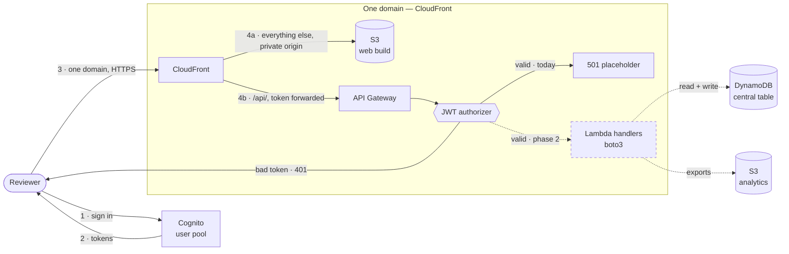
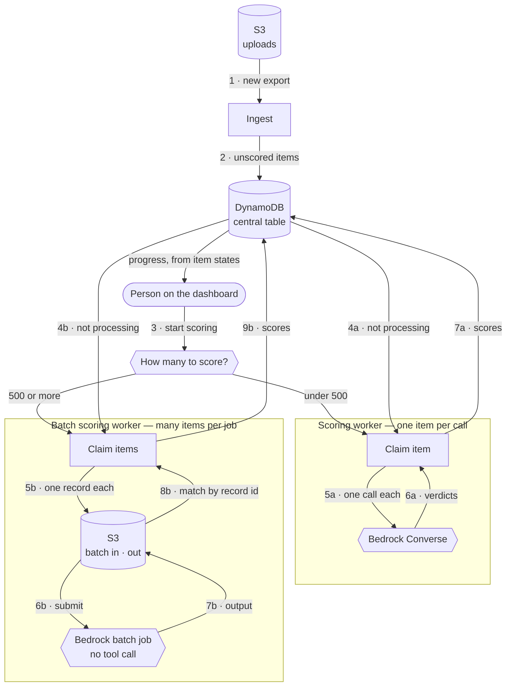

## Purpose

The deployed platform this system runs on: how the web app is served, who can sign
in, how the API is reached, and where data lives. One capability, written in phases —
phase 1 below, the rest as we reach them.

## Architecture

Two diagrams, because they meet in one place: the central table. The reviewer's side
puts requests in and reads results out; the scoring side takes work off the table and
writes scores back. Neither side calls the other. Dashed lines are parts still to be
written; numbers are the order things happen in.

**The reviewer's side — one front door.** The web app and the API sit behind the same
CloudFront distribution on one domain: everything under `/api/` goes to the API, the
rest is the built app. Nothing runs on a laptop, and nothing is served from a second
hostname. CloudFront does not run the handler code — it routes to API Gateway, which
checks the token and calls a Lambda.

**The scoring side — phase 3.** This follows the version-0 architecture from the
project deck: upload to S3, ingest into one central table, a worker that calls Bedrock
and writes results back to the same table. What is added is the second path through
Bedrock batch.

Nothing here starts itself. A person presses a button on the dashboard, and how many
applications need scoring decides which path runs — under 500 the on-demand worker, at 500
or more the batch job. Only the batch path touches S3, because Bedrock batch takes its
records as a file and writes its results back as one.

## Data model

One DynamoDB table per environment, `<env>-scholarship`. Three kinds of item, told apart
by the prefix in the partition key. One table means one name in one environment variable,
one IAM policy, and nothing that has to read across tables.

| `pk` | `sk` | Item |
| --- | --- | --- |
| `COHORT#<scholarship>#<year>` | `APP#<student_uuid>` | one application |
| `APP#<scholarship>#<year>#<student_uuid>` | `SCORE#<timestamp>` | one scoring attempt |
| `RUBRIC#<scholarship>` | `V#<version>` | one rubric version |

Applications sit in their cohort's partition, so a cohort is one Query. Scores sit in a
partition of their own per application, so the cohort read never drags reasoning text
along with it. The sort key on a score is the time it was written, which keeps every
attempt instead of overwriting.

The key attributes are named `pk` and `sk` rather than for what they hold, because what
they hold depends on the item. The prefix inside the value is what says which kind of item
it is, and it makes `begins_with` work on the sort key.

**Applications**

| Attribute | Type | Written by | |
| --- | --- | --- | --- |
| `pk`, `sk` | String | ingest | `COHORT#sjsu_general#26-27`, `APP#3f9a…` |
| `status` | String | both | `parsed` · `processing` · `scored` · `score_failed` |
| `claimed_by` | String | worker | run holding the claim |
| `claimed_until` | String | worker | when the claim expires |
| `attempt` | Number | worker | attempts so far, against the limit |
| `qa_pairs` | List of Maps | ingest | the essays |
| `academic_program`, `academic_level`, `major` | String | ingest | what a search matches on |
| `gpa` | Number | ingest | a number, so it sorts |
| `source` | Map | ingest | file, sheet, row |
| `parsed_at` | String | ingest | |
| `content_hash` | String | ingest | tells a changed application from an unchanged one |
| `category_scores` | Map | worker | `{career_goals: {score, max}, …}` — numbers only |
| `total_score` | Number | worker | `0`–`100` |
| `rubric_version` | String | worker | which weights produced `total_score` |
| `rank_pk` | String | worker | the ranking index's partition key — present only while a comparable total is |
| `latest_scored_at` | String | worker | points at the newest score item |

There is no applicant name field, and nothing adds one. The `Student` column is a UUID and
the export carries no name, so an application is identified by its UUID throughout.

**Scores**

| Attribute | Type | |
| --- | --- | --- |
| `pk`, `sk` | String | `APP#sjsu_general#26-27#3f9a…`, `SCORE#2026-08-17T14:22:09Z` |
| `category_scores` | Map | same numbers, plus each criterion's reasoning and evidence |
| `total_score` | Number | as computed at the time |
| `reasoning_summary` | String | |
| `rubric_version` | String | |
| `model_id` | String | |
| `worker` | String | `ondemand` · `batch` |
| `input_tokens`, `output_tokens` | Number | |
| `status` | String | `ok` · `failed` |
| `failure` | String | why, when it failed |

**Rubrics**

| Attribute | Type | |
| --- | --- | --- |
| `pk`, `sk` | String | `RUBRIC#sjsu_general`, `V#v1` |
| `criteria` | List of Maps | `{id, name, max, weight, levels}` — the one home for the weights |
| `published_at`, `published_by` | String | |

**A scoring run needs no item of its own.** Whether a run is in flight, how far it has
got, and what is left are all counts over the cohort Query the screen already makes:
`status` plus an unexpired `claimed_until`. `claimed_by` carries whatever holds the claim —
a run id on the on-demand path, the Bedrock batch job's identifier on the batch path — so
polling a submitted job is a read of any claimed item. Nothing about a run is stored that
the applications do not already say.

`category_scores` and `total_score` appear on both the application and the score item. The
score item is the immutable record, so it has to be readable on its own for history to
mean anything; the application's copy is what a cohort read uses, so a ranking never has
to open 4,887 score items. Both are written together, and neither is the place a weight
change is applied first — see the total requirement in phase 3.

`status` and `year` are DynamoDB reserved words. Every expression touching them needs
`ExpressionAttributeNames`.

**One secondary index, and it is what puts a ranked list in order.**

| Index | `pk` | `sk` | Projection |
| --- | --- | --- | --- |
| `rank-by-total` | `rank_pk` — `RANK#<scholarship>#<year>#<rubric_version>` | `total_score` | the fields the ranked list shows |

DynamoDB returns a Query in sort-key order, so a ranked page is one Query on this index and
nothing sorts a cohort — not the browser, not the handler. Reversing the read direction is
what "highest" and "lowest" are.

The rubric version in that key is the one on the application — the version whose weights made
that total. It is inside the partition key on purpose: totals made from different weights land
in different partitions, so a ranked read cannot mix them and no filtering after the read is
needed to keep them apart. Publishing a version writes nothing to any application, so no item
moves partitions and last year's ranked list is still where it was. A worker writes `rank_pk`
when it stores a total and removes it when scoring fails, so the index holds only scored,
comparable applications.

Which version a cohort is ranked under is read off the applications themselves — they carry
it, so nothing else has to record it. A cohort that holds two versions at once, part-way
through a rescore, is the one case where that is a choice rather than a fact, and the screen
names both rather than picking one silently. Unscored and
failed ones have no `rank_pk` and are absent from it — they are counted from the cohort Query
instead, which is the read the dashboard's progress counts already make.

The projection carries the fields the list shows and nothing else, so `qa_pairs` never reaches
the index any more than it reaches a cohort read.

`pk` and `sk` cannot be changed after the table exists, which is why they are pinned here. An
index can be added later; this is the only one, and nothing else about the table is pinned.

## ADDED Requirements

**Phase 1 — front door.**

### Requirement: Web app served over HTTPS from a private origin

The built web app SHALL be served over HTTPS from a CDN in front of a private
storage bucket. The bucket SHALL NOT be reachable directly.

#### Scenario: Reviewer opens the site

- **WHEN** a reviewer opens the environment's web URL over HTTPS
- **THEN** the built web app is served, with TLS terminated at the CDN

#### Scenario: Plain HTTP is not served

- **WHEN** a client requests the web URL over plain HTTP
- **THEN** the request is redirected to HTTPS

#### Scenario: Bucket is not a second front door

- **WHEN** a client requests an object using the storage bucket's own URL
- **THEN** the request is denied

### Requirement: Deep links work in a single-page app

A request for a path the web app routes client-side SHALL return the app shell with
status `200`, not a storage error.

#### Scenario: Direct load of an in-app route

- **WHEN** a reviewer loads `/reviews/some-application-key` directly
- **THEN** the response is `200` carrying the app shell, and the app resolves the
  route in the browser

#### Scenario: Missing asset still errors

- **WHEN** a client requests a path under the app's asset directory that does not
  exist
- **THEN** the response is an error status, not the app shell

### Requirement: A deploy is visible immediately

After a deploy, the next page load SHALL serve the newly built app. Fingerprinted
assets SHALL be cacheable long-term; the app shell SHALL NOT be.

#### Scenario: Load right after a deploy

- **WHEN** a reviewer loads the site after a deploy finishes
- **THEN** the app shell and asset references come from the new build

#### Scenario: Asset caching

- **WHEN** a fingerprinted asset is served
- **THEN** its cache lifetime is long, and a new build changes its filename rather
  than its contents

### Requirement: Sign-in is required and accounts are created by an admin

The platform SHALL have one user directory per environment. Public sign-up SHALL be
refused. An admin SHALL create accounts.

#### Scenario: Public sign-up attempt

- **WHEN** someone tries to register an account themselves
- **THEN** the request is refused and no account is created

#### Scenario: Admin invites a reviewer

- **WHEN** an admin creates an account for a reviewer's email address
- **THEN** the reviewer receives an invitation with a temporary password, and the
  account is marked as needing a password change

#### Scenario: First sign-in

- **WHEN** a reviewer signs in with a temporary password
- **THEN** they are required to set a new password before they receive tokens

#### Scenario: Password below the policy

- **WHEN** a reviewer sets a password shorter than 12 characters, or without a mix of
  upper case, lower case, and digits
- **THEN** the change is refused with a message naming the rule that failed

### Requirement: Sign-in produces short-lived tokens

A successful sign-in SHALL return an identity token and an access token the web app
can send to the API. Access tokens SHALL expire within one hour. A refresh token
SHALL last no longer than 30 days.

#### Scenario: Successful sign-in

- **WHEN** a reviewer signs in with valid credentials
- **THEN** they receive an identity token carrying their email and subject, and an
  access token scoped to this environment's app client

#### Scenario: Access token expiry

- **WHEN** an access token is more than one hour old
- **THEN** it is no longer accepted by the API

#### Scenario: Sign-out

- **WHEN** a reviewer signs out
- **THEN** their session is ended and their refresh token can no longer mint new
  access tokens

### Requirement: The web app and the API share one domain

An environment SHALL have one public hostname. Paths under `/api/` SHALL be served by
the API; every other path SHALL be served by the web app. The web app SHALL call the API
on its own origin using a relative path, not a second hostname.

#### Scenario: API request

- **WHEN** a client requests a path under `/api/` on the environment's hostname
- **THEN** the request is routed to the API and the response comes back over TLS

#### Scenario: App request

- **WHEN** a client requests any other path
- **THEN** the built web app is served

#### Scenario: No second hostname in the app

- **WHEN** the web app is built for an environment
- **THEN** its API calls are relative to its own origin, and the bundle contains no
  separate API hostname

#### Scenario: Token from another environment

- **WHEN** a token issued by one environment's directory is presented to another
  environment's hostname
- **THEN** the response is `401`

### Requirement: The front door passes tokens through and never caches an API response

The distribution SHALL forward the `Authorization` header to the API. It SHALL NOT cache
any response from the API. It SHALL NOT forward the viewer's `Host` header to the API
origin.

#### Scenario: Token reaches the token check

- **WHEN** a request carries `Authorization: Bearer <token>` to a path under `/api/`
- **THEN** the API receives that header and the token check runs against it

#### Scenario: One reviewer's data is never served to another

- **WHEN** two reviewers request the same API path with different tokens
- **THEN** each gets a response produced for their own request, and no API response is
  served from cache

#### Scenario: Assets are still cached

- **WHEN** a fingerprinted asset outside `/api/` is requested
- **THEN** it is served from cache when available

### Requirement: Unauthenticated API calls are rejected at the edge

Every route behind the API endpoint SHALL require a valid access token, sent as
`Authorization: Bearer <token>`. A request failing that check SHALL be rejected with
`401` at the edge and SHALL NOT reach anything behind it.

#### Scenario: No token

- **WHEN** a request arrives with no `Authorization` header
- **THEN** the edge responds `401` and nothing behind it runs

#### Scenario: Token from a different issuer

- **WHEN** a request carries a well-formed token issued by some other directory
- **THEN** the edge responds `401` and nothing behind it runs

#### Scenario: Expired token

- **WHEN** a request carries an access token whose expiry has passed
- **THEN** the edge responds `401` and nothing behind it runs

#### Scenario: Token for the wrong client

- **WHEN** a request carries a valid token whose audience is not this environment's
  app client
- **THEN** the edge responds `401` and nothing behind it runs

#### Scenario: Valid token

- **WHEN** a request carries an unexpired access token from this environment's
  directory and app client
- **THEN** the edge passes it through, along with the caller's subject and email
  claims

### Requirement: Placeholder response until API routes are defined

While the API's routes are still being defined, an authorized request SHALL receive
`501` with a plain message saying the API is not wired up yet. This placeholder SHALL
read no data store.

#### Scenario: Authorized request, no route behind it

- **WHEN** a caller with a valid token requests any path
- **THEN** the response is `501` with a plain message

#### Scenario: Placeholder touches nothing

- **WHEN** the placeholder answers a request
- **THEN** it reads no table and no bucket

### Requirement: No cross-origin access is granted

Because the app and the API share one origin, the API SHALL NOT grant cross-origin
access to anyone.

#### Scenario: Call from the web app

- **WHEN** the web app calls the API
- **THEN** it is a same-origin request and no preflight is needed

#### Scenario: Call from another origin

- **WHEN** a browser on any other origin calls the API
- **THEN** no origin is granted access, and the browser blocks the response

### Requirement: API requests are traceable

The edge SHALL record for every request the path, method, response status, and
whether the token check passed.

#### Scenario: Rejected call is findable

- **WHEN** the edge rejects a request with `401`
- **THEN** a log entry exists with the path, method, status, and why the check failed

### Requirement: Each environment owns its own data stores

An environment SHALL have one table holding applications, scores, and rubrics, and one
bucket holding uploaded workbooks, batch files, and analytics under separate prefixes, both
named so they cannot collide with another environment's. Creating an environment SHALL NOT
read from or write to any store outside it.

#### Scenario: Environment is created

- **WHEN** the `dev` environment is deployed for the first time
- **THEN** an empty `dev`-named table exists, along with an empty `dev` bucket

#### Scenario: Environment is deployed again

- **WHEN** an environment that already holds data is deployed again
- **THEN** its table and bucket keep what is in them, and neither is replaced or emptied
  by the deploy

#### Scenario: Table keys

- **WHEN** any item is written
- **THEN** it is addressed by a partition key and a sort key whose prefixes say which
  kind of item it is: an application by its cohort and student, a score by its
  application and the time it was written, a rubric by its scholarship and version

#### Scenario: One kind of item cannot be mistaken for another

- **WHEN** a read asks for one kind of item
- **THEN** the key prefix keeps the other kinds out of the result, and no two kinds can
  collide on one key

### Requirement: Data at rest is encrypted and recoverable

Every table and bucket the platform owns SHALL be encrypted at rest, SHALL refuse
unencrypted transport, and SHALL survive deletion of the deployment that created it.

#### Scenario: Transport

- **WHEN** a client tries to reach a bucket or table over an unencrypted connection
- **THEN** the request is denied

#### Scenario: Tearing down a deployment

- **WHEN** the deployment defining an environment is deleted
- **THEN** its table and analytics bucket are retained, not destroyed

#### Scenario: Recovering a table

- **WHEN** a table needs to be restored to an earlier point in time within the
  retention window
- **THEN** point-in-time recovery makes that possible

### Requirement: The platform is defined in code

Every resource above SHALL be created and changed through the infrastructure code in
this repo. A reviewer SHALL be able to see the pending difference before it is
applied.

#### Scenario: Change is previewed

- **WHEN** an engineer asks for the difference between the code and what is deployed
- **THEN** the pending resource changes are listed before anything is applied

#### Scenario: Console change is not the source of truth

- **WHEN** a resource is edited by hand in the console
- **THEN** the next deploy from code reports the drift and puts the resource back to
  what the code says

### Requirement: The web app is configured at build time

The web app SHALL get its user directory id, app client id, and sign-in domain from
build-time configuration, not hardcoded values. It SHALL NOT need an API base URL,
because the API is on its own origin.

#### Scenario: Build for an environment

- **WHEN** the web app is built for an environment
- **THEN** the bundle points at that environment's user directory and sign-in domain,
  and contains no localhost URL

#### Scenario: Missing configuration

- **WHEN** a required value is absent at build time
- **THEN** the build fails with a message naming the missing value

### Requirement: Authentication is the user directory's job, not the application's

The platform SHALL NOT contain authentication logic of its own. Signing in, the password
policy, lockout, password reset, and the sign-in page itself SHALL be the managed
directory's, configured rather than coded. The application's only part SHALL be
redirecting to it, exchanging the authorization code for tokens, and attaching the token
to requests.

#### Scenario: No credentials are checked by our code

- **WHEN** a reviewer signs in
- **THEN** no code in this repo compares a password, hashes one, or stores one

#### Scenario: No token is verified by our code

- **WHEN** an API request carries a token
- **THEN** the signature, issuer, audience, and expiry are checked by the managed edge,
  not by handler code

#### Scenario: Changing the password rules

- **WHEN** the password policy needs to change
- **THEN** it changes in the directory's configuration, with no application code touched

#### Scenario: The sign-in page looks like ours

- **WHEN** the sign-in page needs the university's logo and colours
- **THEN** that is the directory's branding configuration, not a page we build

### Requirement: The web app signs in against the user directory

The web app SHALL send a signed-out visitor to the directory's hosted sign-in page, take
the authorization code it returns, and exchange it for tokens using the code flow with
PKCE. It SHALL NOT collect a password itself.

#### Scenario: Signed-out visitor

- **WHEN** someone with no valid session opens any page
- **THEN** they are sent to the hosted sign-in page and see no application data first

#### Scenario: Return from sign-in

- **WHEN** the visitor comes back with an authorization code
- **THEN** the app exchanges it for tokens and lands them on the page they asked for

#### Scenario: Password is never handled by the app

- **WHEN** a reviewer types their password
- **THEN** they are typing it on the hosted sign-in page, not in the application's own
  form

#### Scenario: Sign-out

- **WHEN** a reviewer signs out
- **THEN** their tokens are dropped from the browser and the directory's session is ended

### Requirement: Every API call carries a token, and expiry is handled

The web app SHALL attach the access token to every API request. It SHALL refresh the
token before it expires, and SHALL send the reviewer back to sign-in when refreshing is
no longer possible.

#### Scenario: Normal call

- **WHEN** the app calls the API while signed in
- **THEN** the request carries `Authorization: Bearer <access token>`

#### Scenario: Token about to expire

- **WHEN** the access token is close to its expiry and a refresh token is still valid
- **THEN** the app gets a new access token without interrupting the reviewer

#### Scenario: Refresh no longer possible

- **WHEN** the API answers `401` and the refresh token is expired or revoked
- **THEN** the reviewer is sent back to sign-in, and no stale data is left on screen as
  if it were current

### Requirement: The web app shows work that has not finished

Scoring is asynchronous. The app SHALL show an application's scoring state rather than an
empty or zero score, and SHALL NOT present a partly scored cohort as complete.

#### Scenario: Application not scored yet

- **WHEN** an application has no score because a worker has not reached it
- **THEN** the app says it is not scored yet, and shows no score value for it

#### Scenario: Scoring failed

- **WHEN** an application's scoring failed
- **THEN** the app says so, rather than showing it as unscored or as zero

#### Scenario: Cohort still in progress

- **WHEN** a list or total is shown for a cohort that is still being scored
- **THEN** it says how many applications are still waiting

#### Scenario: Results arrive while the page is open

- **WHEN** scoring finishes for applications on a page the reviewer is looking at
- **THEN** the page picks up the new results without the reviewer reloading it

**Phase 3 — scoring workers.** Two workers score the same queue of applications. The
first calls the model one item at a time. The second gathers many items into a single
Bedrock batch job. Both are started by hand from the dashboard — nothing scores on a
schedule or on an upload, so no cohort is ever scored without someone asking for it.

Which worker runs is a question of how much work there is. Batch tokens are cheaper and
carry no rate-limit pressure, but results arrive in hours and there is no tool call.
On-demand returns in seconds but pays full price and throttles at volume. The line between
them is **500 applications**: below that, on-demand finishes while the person who pressed
the button is still at the screen; at or above it, waiting on a batch job is the better
trade.

A worker's job ends when the score is stored. Sign-off, the review queue, and the
AI-detection gate belong to the `human-in-the-loop` capability, so `scored` is where an
item stops moving here.

The per-criterion scores are the durable fact and the total is stored beside them. A total
is arithmetic over those scores, so a weight change is applied by recomputing it — a pass
of arithmetic over data already stored, no model call. Storing it is what lets a cohort be
ranked without opening a score record per applicant, and it is what an index would sort on
if one is ever needed. The cost is that the total can go stale, which is why every stored
total records the rubric version whose weights made it.

Three facts from the Bedrock docs shape this section. All three were checked against the
docs, not recalled:

- **Batch inference does not support tool calling or structured output.** The current
  grader gets clean JSON by forcing a tool call, so the batch path has to ask for JSON
  in the prompt and validate the reply itself.
- **Batch input may be in `Converse` format**, selected with `modelInvocationType`, not
  only the older `InvokeModel` shape. So both workers can send the same prompt, which is
  what makes one shared prompt builder possible rather than two that drift.
- **A batch job has a minimum number of records**, set per model as a service quota
  ("Minimum number of records per batch inference job"). AWS's own examples put it at 100.
  The number is not fixed in the docs, so the worker reads the quota rather than hardcoding
  it — and refuses a set below it instead of submitting a job that cannot run.

**Neither worker caches its prompt, and neither claims to.** The minimum cacheable prefix
is 4,096 tokens on every current Claude model (Bedrock's table lists 1,024 only for older
ones, such as Claude 3.7 Sonnet). The system prompt here is the rubric assembled from the
rubric item's criteria plus the schema block — 3,936 characters against the `rubric.md` text
those criteria are seeded from, roughly 1,000 tokens. That is a quarter of the minimum, so a
cache checkpoint would be accepted and then silently never used: the call still succeeds,
the prefix just is not cached. A cache becomes worth building if the static prefix grows
past 4,096 tokens — the questionnaire approach in `docs/architecture.md` would do it, a
4 KB rubric will not.

### Requirement: The amount of work decides which worker runs

A scoring request SHALL count the applications it would score and choose the on-demand
worker below 500 and the batch worker at 500 or more. A person SHALL be able to override
the choice. The batch worker SHALL refuse a set below the model's minimum records per job
rather than submitting a job that cannot run.

#### Scenario: A small cohort

- **WHEN** fewer than 500 applications need scoring
- **THEN** the on-demand worker runs, and results appear as each item finishes

#### Scenario: A large cohort

- **WHEN** 500 or more applications need scoring
- **THEN** the batch worker runs, and the caller is told the results arrive in hours, not
  minutes

#### Scenario: Someone forces batch on a set that is too small for it

- **WHEN** a person overrides the choice to batch for a set below the model's minimum
  records per job
- **THEN** no job is submitted, and the screen says the set is under the minimum and how
  many records a job needs

#### Scenario: The on-demand path needs no object store

- **WHEN** the on-demand worker runs
- **THEN** it calls the model directly and writes nothing to a bucket, because only the
  batch path exchanges files

#### Scenario: The choice is overridden

- **WHEN** a person asks for a path other than the one the count would pick
- **THEN** that path is used, and the trade it makes — cost against waiting — is stated
  before the run starts

### Requirement: A run is for one cohort and one rubric version, and only that decides what it takes

A run SHALL be started for a scholarship, a year, and the rubric version it scores against.
What it may take SHALL be decided by comparing that version with the version already stored on
each application — nothing else. Publishing a rubric version SHALL NOT make any application
claimable, because publishing writes to no application and starts no run.

#### Scenario: A new rubric version is published

- **WHEN** a rubric version is published for a scholarship — new weights, new criteria, or
  both
- **THEN** nothing about any existing application changes: none becomes claimable, none drops
  out of its ranking, and no trigger count moves, because each application still carries the
  version it was scored under and no run has been asked for

#### Scenario: A run for a version an application already has

- **WHEN** a run for `v1` reaches an application whose stored `rubric_version` is `v1`
- **THEN** it is not claimed and no model call is made for it — the run has nothing to do
  there

#### Scenario: A run for a version an application does not have

- **WHEN** a run for `v2` reaches an application whose stored `rubric_version` is `v1`
- **THEN** it is claimable, and scoring it overwrites that application's scores, total, and
  version, because a rescore is what asking for a different version means

#### Scenario: A run cannot reach outside its cohort

- **WHEN** a run is started for one scholarship and year
- **THEN** it claims nothing in any other cohort, whatever version those applications carry,
  because the cohort partition is what it reads

### Requirement: A worker takes only work that is not already being processed

Every application item SHALL carry a processing state. A worker SHALL take items whose
state is not `processing`, and SHALL skip items already scored under the rubric version the
run is for. An item SHALL NOT become claimable because a rubric version was published, or
because it belongs to a different cohort or year. Finding that work SHALL NOT require
reading the whole table.

#### Scenario: Unprocessed item is picked up

- **WHEN** a worker looks for work and an item's state is not `processing`
- **THEN** that item is a candidate for scoring

#### Scenario: Item already being processed

- **WHEN** an item's state is `processing`
- **THEN** no worker takes it

#### Scenario: Item already scored

- **WHEN** an item already has a score from the rubric version the run is for
- **THEN** no worker takes it, and no second model call is made for it

#### Scenario: Last year's cohort after a rubric change

- **WHEN** a scholarship publishes a rubric version with different criteria and a run is
  started for the new year's cohort
- **THEN** the previous year's applications stay scored, ranked, and unclaimable — they are in
  a different cohort partition, which no run for this year reads, and their stored version is
  not something a publish changed

#### Scenario: Finding work is cheap

- **WHEN** a worker looks for work
- **THEN** it reads one cohort's items, addressed by scholarship and year, not every item
  in the table

### Requirement: Ingesting a workbook again does not destroy what scoring wrote

Ingest SHALL update the application fields it owns and leave every other field alone. It
SHALL NOT reset an application's scoring state unless the application's own content
changed.

#### Scenario: Workbook uploaded twice

- **WHEN** a workbook is ingested again and an application in it is already scored
- **THEN** its score, scoring state, and any review state are still there afterwards

#### Scenario: An application's content changed

- **WHEN** an ingest brings a different essay or field value for an application that was
  already scored
- **THEN** the application is marked for scoring again, and the previous score stays
  readable

#### Scenario: Nothing changed

- **WHEN** an ingest brings the same content an application already has
- **THEN** no scoring work is created for it

### Requirement: One application is one item

An application's key SHALL distinguish the student, the scholarship, and the year. Two
applications SHALL NOT collide on one item, and a duplicate row SHALL NOT be dropped
without being reported.

#### Scenario: Same student, two years

- **WHEN** the same student applies in two different years
- **THEN** the two applications are stored as two items

#### Scenario: Same student, two scholarships

- **WHEN** the same student applies to two scholarships
- **THEN** the two applications are stored as two items

#### Scenario: Duplicate row in one workbook

- **WHEN** a workbook contains two rows that resolve to the same application
- **THEN** the ingest reports the duplicate rather than silently keeping one

### Requirement: An item is claimed before it is scored

A worker SHALL move an item to `processing` with a write that succeeds only if the
state has not changed since it was read. The claim SHALL record which run holds it and
when the claim expires.

#### Scenario: Two workers reach for the same item

- **WHEN** two workers read the same unprocessed item and both try to claim it
- **THEN** exactly one claim succeeds, the other is refused, and the refused worker
  moves to the next item without scoring

#### Scenario: Claim is visible

- **WHEN** a worker claims an item
- **THEN** the item shows the claiming run's id and a claim expiry

#### Scenario: Worker dies holding a claim

- **WHEN** a claim's expiry passes and no score was written
- **THEN** the item becomes available again with its attempt count increased by one

#### Scenario: Worker nears its time limit

- **WHEN** a worker is close to the end of its allowed run time
- **THEN** it stops claiming new items and leaves no item claimed without an owner
  still working on it

### Requirement: The prompt has a static prefix, and no cache is claimed for it

Both workers SHALL build the prompt as a static part — rubric text, instructions, and
schema — followed by the applicant's own text, with nothing per-item inside the static
part: no timestamps, ids, or applicant fields. Neither worker SHALL place a cache
checkpoint, and neither SHALL report cache savings, because the static part is about
1,000 tokens against a 4,096-token minimum on every current model.

#### Scenario: Two items scored in one run

- **WHEN** two applications are scored in the same run
- **THEN** the static part of the prompt is byte-identical between the two calls

#### Scenario: A run reports what it cost

- **WHEN** a run finishes
- **THEN** its log line gives input and output tokens and claims no cache read, cache
  write, or saving

#### Scenario: The static prefix grows past the minimum

- **WHEN** the static part of the prompt is measured at or above the model's minimum
  checkpoint size
- **THEN** caching is worth adding, and until it is measured that way nothing in the
  system claims a cache

### Requirement: The batch worker sends many items as one job

The batch worker SHALL select and claim items by the same rules, write one record per
item with the application key as the record id, submit a single Bedrock batch job, and
match results back to items by record id. Its input and output SHALL be objects in the
environment's bucket under their own prefixes, separate from anything a person downloads.

#### Scenario: Job is submitted

- **WHEN** the batch worker has claimed a set of items
- **THEN** one record per claimed item is written to the environment's bucket, and one
  batch job is submitted pointing at that input and at an output location in the same
  bucket

#### Scenario: The model service reads and writes the objects

- **WHEN** a batch job runs
- **THEN** it reads its input and writes its output under a role that reaches only those
  prefixes in that environment's bucket, and no other bucket or prefix

#### Scenario: Results are matched back

- **WHEN** the job's output is read
- **THEN** each result is written to the item whose application key matches its record
  id

#### Scenario: Record missing from the output

- **WHEN** a claimed item has no result in the job output
- **THEN** that item is marked failed with a reason, not left claimed and not silently
  dropped

#### Scenario: Too few items for a job

- **WHEN** the number of claimed items is below the model's minimum records per batch
  job
- **THEN** no job is submitted, the claims are released, and the caller is told the set is
  under the minimum and how many records a job needs. The work SHALL NOT be moved to the
  on-demand worker instead — someone who asked for batch is told why they cannot have it
  rather than being given the expensive path without saying so

### Requirement: The batch path asks for JSON instead of forcing a tool call

The batch path SHALL NOT send a tool definition or a structured-output setting, because
batch inference supports neither. It SHALL get its JSON by asking for JSON in the prompt
and validating the reply against the expected shape.

#### Scenario: Reply validates

- **WHEN** a batch record's reply matches the expected shape
- **THEN** it is scored and stored like an on-demand reply

#### Scenario: Reply does not validate

- **WHEN** a batch record's reply cannot be read as the expected shape
- **THEN** the item is marked failed, the raw reply is kept for inspection, and no
  partial score is written

#### Scenario: A tool call is never offered

- **WHEN** a batch record is built
- **THEN** it carries no tool definition and no structured-output setting, and the
  expected shape is described in the prompt text

### Requirement: Both workers produce the same result for the same input

Prompt building and reply validation SHALL be one shared implementation. The only
difference between the two workers SHALL be how the model is called.

#### Scenario: Same application, both paths

- **WHEN** the same application is scored by both workers and the model returns the
  same verdicts
- **THEN** the per-criterion verdicts are identical

#### Scenario: The prompt or the validation changes

- **WHEN** the shared prompt or the reply check is changed
- **THEN** both workers use the new version, with no second place to edit

### Requirement: A reply is accepted only if it is complete and in range

A reply SHALL be accepted only when it carries every criterion the rubric names, with ids
that match, and every score within its own criterion's maximum. Anything else SHALL be a
failure. There SHALL be no partial parse, no salvage of whatever criteria could be found,
and no repair step that turns an unreadable reply into a score.

#### Scenario: The reply is cut off

- **WHEN** a model reply is truncated part-way through the criteria
- **THEN** the item fails with the raw reply kept for inspection, and no score is stored
  from the part that arrived

#### Scenario: A criterion is missing

- **WHEN** a reply carries fewer criteria than the rubric names
- **THEN** the item fails, because a total worked out from a partial set is a low score
  rather than a missing one

#### Scenario: A criterion is not one the rubric names

- **WHEN** a reply carries a criterion id the rubric does not define
- **THEN** the item fails, rather than the unknown criterion being skipped and contributing
  nothing to the total

#### Scenario: A score is out of range

- **WHEN** a criterion's score is above that criterion's maximum, or below zero
- **THEN** the item fails, rather than the total being inflated past 100

### Requirement: Scores go in half points

A criterion's score SHALL be a whole or half point, from zero up to that criterion's
maximum. A reply with a finer value SHALL be a failure, not rounded.

#### Scenario: A half point is returned

- **WHEN** a reply scores a criterion at 3.5 of 4, or 0.5 of 1
- **THEN** it is accepted and stored as given, and the weighted total is worked out from it

#### Scenario: A finer value is returned

- **WHEN** a reply scores a criterion at 3.7
- **THEN** the item fails. Rounding it would be the check inventing a score the model did
  not give

#### Scenario: A rubric version is published

- **WHEN** a rubric version is published
- **THEN** its level descriptions allow half points on every criterion, including the 0–1
  Extracurricular Activities criterion, and because the prompt is assembled from those
  descriptions there is no second rubric text that could disagree with them

### Requirement: The rubric item is the only source of the criteria

The prompt, the reply check, the weighted total, and the columns a screen shows SHALL all be
built from the `criteria` list on the rubric item. No criterion id, name, maximum, weight, or
level description SHALL be written into a worker, a handler, or the web app, and no rubric
text file SHALL be read at run time.

#### Scenario: The prompt's rubric text is assembled

- **WHEN** a worker builds the prompt for a cohort
- **THEN** the rubric text in it is assembled from the rubric item's criteria — their names,
  maxima, and level descriptions — so the text the model reads and the ranges the reply check
  enforces cannot disagree

#### Scenario: A rubric version is written for the first time

- **WHEN** the first rubric version for a scholarship is created
- **THEN** `rubric.md` is the source its criteria and level descriptions are seeded from, and
  after that the rubric item is what the system reads — the file is a human-readable original,
  not a second live copy

#### Scenario: A scholarship uses a different set of criteria

- **WHEN** a rubric is published for a scholarship with criteria that are not the SJSU
  General five
- **THEN** its cohort is scored, totalled, and shown against its own criteria, with no code
  change — the rubric item is a data change

#### Scenario: A criterion's maximum or weight changes

- **WHEN** a new rubric version changes a maximum or a weight
- **THEN** the prompt, the range check, and the total all follow it, because none of them
  holds a copy

#### Scenario: A ranked list shows per-criterion columns

- **WHEN** a cohort's per-criterion scores are shown
- **THEN** the columns come from the rubric's criteria in its order, not from a list held
  in the web app

### Requirement: The per-criterion scores are the source of truth and the total is derived from them

A worker SHALL store per-criterion scores and a total worked out from them and the
rubric's weights. Every stored total SHALL record which rubric version's weights produced
it. A total SHALL NOT be taken from the model, and SHALL NOT be the only record of a
score.

#### Scenario: A weight changes

- **WHEN** a criterion's weight is changed and the criteria themselves are unchanged
- **THEN** the totals are worked out again from the per-criterion scores already stored,
  no model is called, and the per-criterion scores are not touched

#### Scenario: The criteria change, not just the weights

- **WHEN** a rubric version adds, removes, or renames a criterion, changes a maximum, or
  changes what a level means
- **THEN** the stored per-criterion scores cannot be recomputed against it, and the
  affected applications keep the rubric version they were scored under until they are
  scored again

#### Scenario: The model returns a total of its own

- **WHEN** a model reply includes a total
- **THEN** it is ignored, and the stored total is the one worked out from the
  per-criterion scores

#### Scenario: A total becomes rankable, or stops being

- **WHEN** a total is stored, recomputed under a new rubric version, or invalidated by a
  failure
- **THEN** the application's ranking-index key is written, moved to the new version's
  partition, or removed with it, so what the index holds is exactly what is comparable

#### Scenario: A total is recomputed part-way

- **WHEN** a recompute over a cohort stops before it finishes
- **THEN** each application's stored rubric version says which weights its total came
  from, so the ones not yet recomputed are identifiable rather than silently mixed in

### Requirement: A scored item records how it was scored

A stored result SHALL carry the per-criterion scores and their evidence, the total worked
out from them, the model id, the rubric version, which worker produced it, its token
counts, and when it was written. It SHALL be readable on its own, without needing the
application item to make sense of it.

#### Scenario: Result is written

- **WHEN** a worker writes a score
- **THEN** the stored result carries all of those fields

#### Scenario: An item is scored again

- **WHEN** an item is scored a second time, for example after a rubric change
- **THEN** the earlier result is still readable and the item points at the newest one

### Requirement: Failures are visible and bounded

A failed item SHALL be left in a `failed` state with a reason and an attempt count.
Attempts SHALL stop at a fixed limit. No item SHALL sit in `processing` with nothing
working on it.

#### Scenario: Model throttles the worker

- **WHEN** a model call is throttled
- **THEN** the worker waits and retries, and the item is not marked failed on the
  first throttle

#### Scenario: Last attempt fails

- **WHEN** an item's final allowed attempt fails
- **THEN** it is marked failed with the reason, its attempt count at the limit, and no
  worker picks it up again

#### Scenario: Run summary

- **WHEN** a run finishes
- **THEN** it logs how many items it claimed, scored, failed, and skipped, with the
  token totals for the run

## Phase 2 — API runtime

_Next up. Run the API on AWS behind the phase-1 edge, and settle its route contract._

TBD

**Phase 4 — the screens.** The last phase, and the one that makes the work visible. With
no reviewer loop built, these screens are the whole output. The work splits across the two
the web app already has, and one that stays shut:

| Screen | Its job |
| --- | --- |
| Dashboard | A trigger section, and for now that is the whole screen: upload a workbook, every trigger, and progress. The reliability analysis already there is kept in the code, below it, untouched |
| Scholarships | Find an application, rank a cohort, read the per-criterion scores, export |
| Reviews | Nothing yet. Sign-off is not built, so it is not offered |

**The dashboard is where work gets in and where it starts.** For this phase the dashboard is a
trigger section — the upload, the triggers, and the progress counts, and nothing else is built
on it. The reliability analysis already on the screen is kept as it stands, below the trigger
section; it is not rebuilt, and it is not deleted.

The first is the upload. A person picks a workbook on the dashboard and it goes to the
uploads prefix in the environment's bucket, where ingest picks it up. That is the only way an
export gets into the system, and it is the only thing an upload triggers — the file landing
does not start scoring.

The second is the triggers. Scoring the unscored, recomputing a total after a weight change,
rescoring what changed, and retrying what failed all start from a button here rather than
from a schedule or the upload. That keeps a model bill from being run up by a file landing in
a bucket, and it means the person who asked for the work is the person watching it. The
dashboard needs no extra data to report progress: a cohort Query returns each application's
state, so done, running, and left are counts over items it already reads.

**What is already on the dashboard stays as it is.** Its reliability sections —
human-versus-human against AI-versus-human agreement, the reviewer distribution, and the
per-criterion and per-scholarship breakdowns — belong to a different feature that is waiting on
last year's reader scores. They are kept, not deleted and not rebuilt: this phase's work on the
dashboard is the trigger section. What they cannot do is hold the new work up, so they show as
waiting on data while the upload, the triggers, and the progress counts work without them.
Nothing added here is allowed to depend on a human score.

The two halves are also scoped differently, which is why they cannot share one fetch or one
cohort picker: the trigger section is about one scholarship and one year, while a
per-scholarship breakdown is about all of them.

**The scholarships screen is where results are read.** The ranked list is one Query on the
ranking index, which returns applications already in score order — the store does the
ordering, and no score record has to be opened to get it. Opening one application is where
the per-criterion reasoning and evidence get read. The counts beside the list — unscored,
failed, scored under an older rubric version — come from the cohort Query, because those
applications are deliberately not in the index.

That screen already has a search: a filter panel over a fetched cohort, in
`apps/web/src/features/scholarships/applications-list.tsx`. The advanced search is that code
carried forward and extended, not a second search built beside it. What changes underneath is
the data it reads — the cohort id and the score fields both move with the new model — and the
markup, which is rebuilt on the app's own components.

That screen can also hand the results over as JSON, built from what it already fetched, so
the export writes nothing to S3 — a cohort of 5,000 applications at the fields below is around
a megabyte. What it must not be is a dump of the raw items: the
claim fields, attempt counts, content hashes, and internal keys mean nothing outside the
pipeline, and DynamoDB's type wrappers make the file harder to read for no gain.

**Reasoning text is a checkbox, and it is the one thing that changes what an export costs.**
Per-criterion scores sit on the application item, so an export without reasoning is a
client-side build off the one Query the screen already made. Reasoning and evidence sit on the
score items, so an export with it has to read the newest score item for every application in
the file — 4,887 of them for a full cohort. The box therefore defaults to off, and checking it
says what it is about to do first.

That read is a `BatchGetItem` on exact keys, not a scan: the application carries
`latest_scored_at`, which is the sort key of its newest score item, so the keys are known
before the call. A hundred per request, about fifty requests for a full cohort. Slow enough to
show progress, cheap enough not to need a job.

Exporting one open application always carries its reasoning, box or not — the detail screen
read that score item to render the page.

Three things this phase has to be careful about, because each quietly produces a wrong
answer:

- A cohort part-way through scoring. Ranking 4,887 applications when 3,000 have no score
  yet gives a leaderboard made mostly of nothing. Unscored and failed applications are
  kept out of the ranking and counted separately.
- Totals from two different rubric versions in one list. A stored total is only comparable
  with another total made from the same weights. The rubric version sits inside the ranking
  index's partition key, so a read for the cohort's current version cannot return a total made
  from older weights; those applications are counted from the cohort Query instead.
- Sign-off. Nobody has signed anything off, because `human-in-the-loop` is not built.
  The screen has to say so, or the top of a sorted list reads as a decision.

**There is no name to search, and no name column is added.** The export is anonymized: the
`Student` column holds a UUID, which is the applicant's identifier here. Search matches that
UUID and the stored fields beside it — program, level, major, GPA.

**Search does not reach inside the essay text.** It matches the applicant identifier and the
stored fields beside it, and nothing else. Searching essays would mean either reading every
cohort's essay text on every query — which is the read cost the `ProjectionExpression`
exists to avoid — or standing up a search service, which nothing here is scoped for.

### Requirement: A person can search a cohort

A search SHALL be scoped to one scholarship and year, and SHALL match on the applicant
identifier and the fields stored alongside it. Matching SHALL ignore capitalisation and
SHALL match part of a word. A search with no matches SHALL return nothing rather than
everything.

#### Scenario: Partial match

- **WHEN** a person types part of an applicant identifier or a stored field value
- **THEN** the applications containing it are listed, whatever the capitalisation

#### Scenario: Nothing matches

- **WHEN** no application matches what was typed
- **THEN** the screen says none matched and lists none

#### Scenario: Search is scoped

- **WHEN** a search runs
- **THEN** it covers the chosen scholarship and year only, not every cohort at once

#### Scenario: A word from an essay is typed

- **WHEN** a person types a word that appears only in an applicant's essay text
- **THEN** nothing matches, and the screen says what search covers rather than looking
  broken

#### Scenario: No search term

- **WHEN** the search box is empty
- **THEN** the whole cohort is listed

#### Scenario: An unscored application is searched for

- **WHEN** a person searches for an applicant whose application has no comparable total
- **THEN** they find it, because search covers the cohort read rather than the ranking index,
  and it appears with its state among the applications held out of the ranking rather than
  inside the ordered list

#### Scenario: The screen already filters a cohort

- **WHEN** the search is built
- **THEN** the filter panel already on the scholarships screen is carried forward and
  extended, rather than a second search being built beside it

#### Scenario: A filter no longer has a field behind it

- **WHEN** an existing filter reads a field the new data model does not have
- **THEN** that filter is dropped or pointed at the field that replaced it, and no filter
  is left on screen matching against nothing

### Requirement: Results can be ranked highest or lowest

A person SHALL be able to order a cohort by score, highest first or lowest first. The order
SHALL come from the ranking index, read in the direction the person asked for. Only totals
made from the same rubric version SHALL be ordered against each other. Nothing SHALL sort a
cohort in a handler or in the browser.

#### Scenario: Ranked highest first

- **WHEN** a person ranks a cohort highest first
- **THEN** the applications come back from the ranking index in that order, largest total
  first, without anything reordering them afterwards

#### Scenario: The direction is flipped

- **WHEN** a person switches from highest first to lowest first
- **THEN** the same index is read in the other direction, and no second ordering is
  maintained for it

#### Scenario: An unscored application

- **WHEN** a cohort holds applications with no score, or whose scoring failed
- **THEN** they are left out of the ranking and reported as a count, not placed at the
  bottom as zero

#### Scenario: A cohort holding two rubric versions

- **WHEN** a cohort's applications carry more than one `rubric_version`, part-way through a
  rescore
- **THEN** the screen names both versions and ranks one of them, reporting the other as a
  count, rather than ordering totals made from different weights against each other

#### Scenario: A weight changes

- **WHEN** a criterion's weight changes and the cohort's totals are recomputed
- **THEN** the next ranking reflects the new weight, and no per-criterion score was
  rewritten to get there

### Requirement: Reading a cohort does not read the whole table

Fetching, searching, or ranking a cohort SHALL address it by scholarship and year rather than
reading every item in the table.

#### Scenario: One cohort is opened

- **WHEN** a person opens one scholarship and year
- **THEN** only that cohort's items are read

#### Scenario: A ranked page is read

- **WHEN** a ranked page is read from the ranking index
- **THEN** it is addressed by scholarship, year, and rubric version, so no other cohort's
  items are read and nothing is scanned

### Requirement: The screens say the scores are unreviewed

Every score shown SHALL be marked as not signed off, and a ranking SHALL say how much of
the cohort it covers.

#### Scenario: A score is shown

- **WHEN** a score appears on the screen
- **THEN** it is marked as unreviewed, because no sign-off exists yet

#### Scenario: A ranking is shown

- **WHEN** a ranked list is shown
- **THEN** it says how many of the cohort are ranked, unscored, failed, and scored under
  an older rubric version

### Requirement: The workbook is uploaded from the dashboard

The dashboard SHALL be where a person uploads an application export. The file SHALL go to
the uploads prefix in the environment's bucket, where ingest reads it. An upload SHALL NOT
start scoring.

#### Scenario: A person uploads an export

- **WHEN** a person picks a workbook on the dashboard
- **THEN** it is stored under the uploads prefix, ingest writes its applications into the
  cohort, and the screen says how many rows came in

#### Scenario: An upload lands

- **WHEN** a workbook finishes uploading
- **THEN** nothing is scored, and the cohort's applications sit unscored until someone
  presses the scoring button

#### Scenario: The same workbook is uploaded twice

- **WHEN** an export is uploaded again for a cohort that has already been scored
- **THEN** the scores already stored survive it, as the ingest requirement in phase 3
  demands, and the screen says what the re-ingest changed

### Requirement: Every trigger lives on the dashboard

The dashboard SHALL be the one place a person starts work. It SHALL offer scoring the
unscored, recomputing totals after a weight change, rescoring what changed, and retrying
what failed — each scoped to a chosen scholarship and year. No other screen SHALL start
any of them.

#### Scenario: A person looks for the button

- **WHEN** a person wants to start any kind of work on a cohort
- **THEN** they find it on the dashboard, and the screen that shows results offers no way
  to start it

#### Scenario: The trigger section is scoped to a cohort

- **WHEN** the dashboard is opened
- **THEN** its trigger section is scoped to one scholarship and year, because every count and
  every button in it means nothing without one. The reliability sections below keep their own
  scope, which is every scholarship

#### Scenario: A trigger with nothing to do

- **WHEN** a cohort has nothing unscored, nothing failed, and nothing carrying a version other
  than the one asked for
- **THEN** the matching button is offered as unavailable with its count at zero, rather
  than hidden or pressable to no effect

#### Scenario: A weight-only rubric change

- **WHEN** a person asks to move a cohort to a version that changes weights but not criteria
- **THEN** the dashboard offers a recompute over the stored per-criterion scores, and says
  it costs no model call

#### Scenario: A criteria change

- **WHEN** a person asks to move a cohort to a version that changes a criterion's id, name,
  maximum, or level text
- **THEN** the dashboard offers a rescore rather than a recompute, because arithmetic over
  the stored scores cannot produce the new ones, and it says how many model calls that is
  before anything runs

#### Scenario: A new version exists and nobody has asked for it

- **WHEN** a rubric version is published and no one has asked to move a cohort to it
- **THEN** the recompute and rescore buttons are unavailable with their counts at zero, and no
  cohort is described as stale — a cohort's applications say which version scored them, and a
  publish does not change that

#### Scenario: Nothing added to the dashboard needs a human score

- **WHEN** the upload, the triggers, or the progress counts are built
- **THEN** none of them compares the model against a reviewer, so all of them work while
  last year's reader scores are still missing

### Requirement: The dashboard's reliability sections are kept

The reliability analysis already on the dashboard — human-versus-human against
AI-versus-human agreement, the reviewer distribution, and the per-criterion and
per-scholarship breakdowns — SHALL stay. It SHALL NOT be removed to make room for the
trigger section, and SHALL NOT be rebuilt in this phase. Where it has no data, it SHALL say
it is waiting on data.

#### Scenario: The trigger section is added

- **WHEN** the upload and the triggers are added to the dashboard
- **THEN** the reliability sections are still there, left as they are, below the trigger
  section

#### Scenario: Last year's reader scores are still missing

- **WHEN** a reliability section has no human scores to compare against
- **THEN** it says it is waiting on data, and shows no number, no percentage, and no
  empty chart that could be read as a result

#### Scenario: A reliability section fails to load

- **WHEN** the reliability data cannot be fetched
- **THEN** the upload, the triggers, and the progress counts still work, because they do
  not depend on it

### Requirement: Scoring is started by hand

Scoring SHALL start only when a person asks for it, for a chosen cohort. Nothing SHALL
score on a schedule or because a workbook was uploaded. The dashboard SHALL say how many
applications the run would cover and which path it will take before it starts.

#### Scenario: A person starts scoring

- **WHEN** a person starts scoring for the chosen cohort
- **THEN** only that cohort's unscored applications are scored, and the screen says how
  many were picked up and which path is running

#### Scenario: Nothing is scored without being asked

- **WHEN** a workbook is ingested
- **THEN** its applications sit unscored until someone starts a run

#### Scenario: Already scored applications are skipped

- **WHEN** a run is started on a cohort that is partly scored under the version the run is for
- **THEN** only the unscored, the failed, and the ones carrying another version are picked up,
  and the screen says how many that is

#### Scenario: A second person presses the button

- **WHEN** someone starts a run while one is already working through the same cohort
- **THEN** the claims already held are not taken again, and they are told how much of the
  cohort is already being worked on rather than starting a duplicate run

#### Scenario: A run is in progress

- **WHEN** a person opens the dashboard for a cohort that is being scored
- **THEN** it says so, with how many are done and how many are left, worked out from the
  applications themselves

#### Scenario: The batch path is running

- **WHEN** a batch run has been submitted and its results have not come back
- **THEN** the dashboard says the wait is hours and does not present the cohort as nearly
  finished

### Requirement: The review screen is not offered until sign-off is built

The screens SHALL NOT present reviewer sign-off, a review queue, or the AI-detection gate
as available. Where the web app already has a place for them, that place SHALL say it is
not built rather than showing an empty or broken version of it.

#### Scenario: A person looks for the review screen

- **WHEN** a person looks for somewhere to review or sign off a score
- **THEN** the app says that part is not built yet, and offers no partly-working version of
  it

#### Scenario: A reviewer field appears in the data

- **WHEN** a screen shows an application's scores
- **THEN** it shows no reviewer identity, no approval, and no comparison against a human
  score, because none of those exist

### Requirement: The screens look like the rest of the app

What this phase builds — the dashboard's trigger section and the search screen — SHALL be
built from the components and styling the web app already has. It SHALL NOT introduce a
second design system, a second styling approach, or a new UI dependency. Where a component
for what it needs already exists, it SHALL be used rather than rebuilt. The reliability
sections are not built by this phase and are left as they are.

#### Scenario: A screen is laid out

- **WHEN** the trigger section or the search screen is built
- **THEN** it sits inside the app's existing shell — the icon rail, the sticky header, and
  the framed outlet — so it does not read as a separate tool

#### Scenario: The ranked list

- **WHEN** the cohort is shown as a sortable, ranked table
- **THEN** it uses the app's existing table, sortable column header, and sort-state hook,
  not a new table implementation. Sorting cycles highest, lowest, then off, which is what
  that hook already does

#### Scenario: Empty, loading, and error states

- **WHEN** a cohort is loading, fails to load, has nothing in it, or has nothing matching
  the current filters
- **THEN** the screen uses the app's existing table-overlay component, which already tells
  those four cases apart, rather than a bare line of text per case

#### Scenario: Two styling generations exist

- **WHEN** an older screen is reused for its behaviour — a cohort fetch, a filter panel,
  pagination, a ranked list
- **THEN** the behaviour is carried over but the markup is rebuilt on the shared
  components, so no hand-rolled input, button, or table and no hard-coded colour reaches
  the new screen

#### Scenario: A new dependency is proposed

- **WHEN** the screen appears to need a UI library the app does not already have
- **THEN** it is raised as a decision before being added, not installed as part of building
  the screen

### Requirement: Results can be exported as JSON

A person SHALL be able to download what the screen is showing as a JSON file. The export
SHALL carry the applicant identifier, the stored fields the screen lists, the per-criterion
scores with their maxima, the total, and the rubric version behind it. It SHALL NOT carry
the fields the pipeline uses to run itself.

#### Scenario: Export of a search result

- **WHEN** a person exports a search result
- **THEN** the file holds one entry per matching application, in the order shown, each with
  its identifier, stored fields, per-criterion scores and maxima, total, and rubric version

#### Scenario: Pipeline machinery is left out

- **WHEN** an export is produced
- **THEN** it contains no claim holder, claim expiry, attempt count, content hash, or raw
  key, because none of them mean anything outside the pipeline

#### Scenario: Plain JSON

- **WHEN** an export is read by something other than this application
- **THEN** its numbers are numbers and its strings are strings, with no storage-engine type
  wrappers around them

#### Scenario: Nobody is dropped from the export

- **WHEN** the matched applications include unscored or failed ones
- **THEN** they appear in the export with their state named and no score, rather than being
  left out of the file

#### Scenario: The export carries the same warnings as the screen

- **WHEN** an export is produced
- **THEN** it states that the scores are unreviewed, how many of the cohort are ranked,
  unscored, failed, and on an older rubric version, and which fields it deliberately
  leaves out

### Requirement: Reasoning text in an export is a choice, and its cost is stated

A person SHALL choose whether an export carries each criterion's reasoning and evidence. The
choice SHALL default to leaving it out, and the screen SHALL say what including it costs
before it runs, because the text lives on the score items and a cohort export has to open one
per application to get it.

#### Scenario: The box is left unchecked

- **WHEN** a cohort or a search result is exported with reasoning not selected
- **THEN** the file carries per-criterion scores and maxima, the total, the rubric version,
  and each application's state, and it is built from the cohort read the screen already made

#### Scenario: The box is checked

- **WHEN** a person selects reasoning and exports a cohort
- **THEN** the newest score item for each exported application is read, and every criterion's
  reasoning and evidence is in the file alongside its score

#### Scenario: The cost is stated before it runs

- **WHEN** the reasoning box is checked
- **THEN** the screen says how many applications it will read and that the file will be
  larger and slower, so a 4,887-application export is a decision rather than a surprise

#### Scenario: A score item cannot be read

- **WHEN** reasoning is selected and one application's score item is missing or unreadable
- **THEN** that application is still in the file with its scores and its reasoning marked as
  not read, and the export does not fail whole

#### Scenario: One application is exported

- **WHEN** a person exports the application they have open
- **THEN** that file carries its per-criterion reasoning and evidence in full whatever the box
  says, because the screen has already read its score item to show the detail

## The human in the loop

Its own capability, part-written: `specs/human-in-the-loop/spec.md`. Sign-off, the
review queue, and the AI-detection gate live there, not in this spec.
